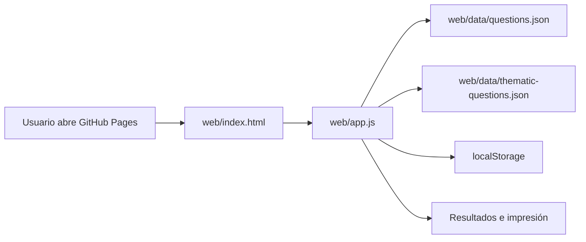

# Arquitectura del proyecto

La aplicación es una web estática servida desde `web/` y publicada con GitHub Pages.
No hay backend: los bancos de preguntas se leen como JSON y el progreso del usuario
se guarda en `localStorage`.

## Componentes

| Componente | Ruta | Responsabilidad |
| --- | --- | --- |
| Interfaz | `web/index.html` | Estructura de vistas y controles |
| Lógica | `web/app.js` | Estado del test, navegación, guardado y resultados |
| Estilos | `web/styles.css` | Diseño responsive e impresión |
| Banco principal | `web/data/questions.json` | Preguntas extraídas de exámenes |
| Banco por temario | `web/data/thematic-questions.json` | Preguntas generadas por bloque temático |
| Revisión | `data/answer-review.json` | Cola auditada de respuestas |
| Seeds | `data/*answer-seeds*.json` | Lotes reproducibles de respuestas |
| E2E | `tests/e2e/app.spec.js` | Casos de uso principales |
| Publicación | `.github/workflows/pages.yml` | Validación y despliegue |

## Flujo en ejecución

## Persistencia local

La app usa dos claves de `localStorage`:

- `tcae-saved-tests`: tests guardados, progreso, respuestas y estado completado.
- `tcae-wrong-questions`: preguntas falladas para repetirlas más tarde.

## Notas relacionadas

- [[Banco de preguntas]]
- [[Pruebas E2E]]
- [[Despliegue]]
