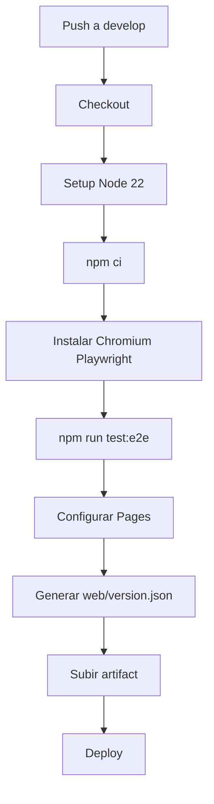

# Despliegue

La web se publica con GitHub Pages desde la rama `develop`.

## Flujo de GitHub Actions



## Versionado visible

Durante el despliegue se genera `web/version.json` con:

- `commit`: hash corto desplegado.
- `deployedAt`: fecha UTC.

La app lo muestra en el pie de página.

## Comprobación rápida

```bash
curl -fsSL "https://epastorc.github.io/oposici-n-tcae/version.json"
```

## Riesgos habituales

- Si Playwright falla, no se publica.
- Si `web/data/questions.json` no carga, fallan los E2E.
- Si `version.json` no existe localmente, la app lo ignora; en Pages se genera en CI.

## Notas relacionadas

- [[Pruebas E2E]]
- [[Flujos de mantenimiento]]
